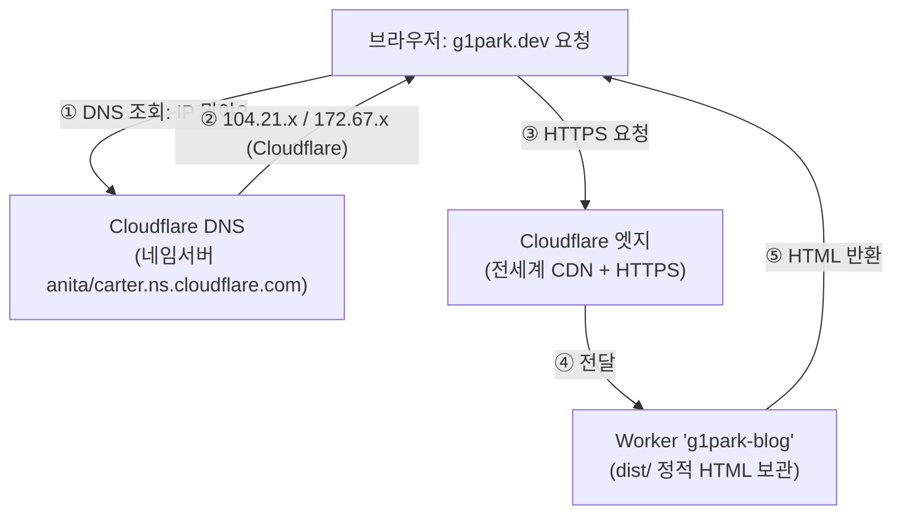
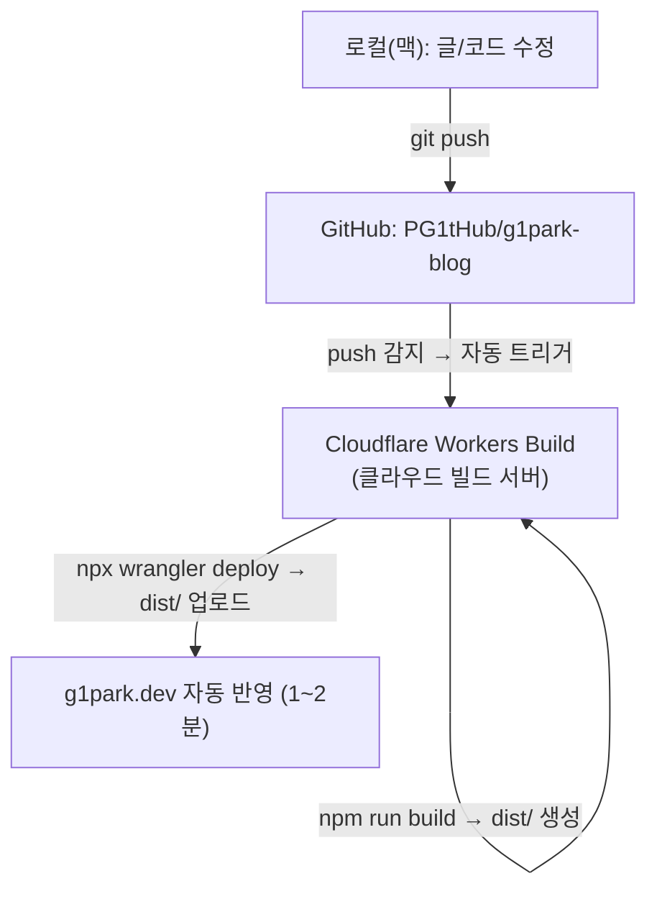

# CLAUDE.md — g1park.dev 기술 블로그 (프로젝트 핸드오프 / 런북)

> **이 문서의 목적**: 사람과 AI 어시스턴트 모두가 이 파일 하나만 읽으면 프로젝트 전체 맥락을
> 이해하고 이어서 작업할 수 있게 한다. **컴퓨터를 바꾸거나 새 세션을 시작해도** `git clone` 후
> 이 파일을 읽으면 된다.
>
> _마지막 갱신: 2026-06-21_

---

## 0. 프로젝트 개요

- **무엇**: 개인 **AI 에이전트 엔지니어링** 기술 블로그
- **목표**: ① 커리어 어필 ② 검색 유입(SEO)·장기 콘텐츠 자산 ③ 개발자 커뮤니티 평판 ④ 제품 홍보
- **운영자**: g1park (GitHub `PG1tHub`)
- **콘텐츠 원칙**: 추상적 개론보다 **"겪은 구체적 문제 → 해결 과정"** (디버깅/설계 결정 기록)이
  네 가지 목표 전부에 가장 잘 먹힌다.

## 1. 주요 링크 / 좌표

| 항목 | 값 |
|---|---|
| 라이브 사이트 | https://g1park.dev |
| 임시 주소(항상 동작) | https://g1park-blog.parkpark827.workers.dev |
| GitHub 저장소 | https://github.com/PG1tHub/g1park-blog (public) |
| 로컬 경로(현재 맥) | `/Users/g1/g1park-blog` |
| 도메인 등록처 | 가비아(Gabia) |
| 호스팅/DNS/CDN | Cloudflare |

## 2. 기술 스택 (확정)

| 항목 | 선택 | 비고 |
|---|---|---|
| 프레임워크 | **Astro** `v6.4.x` | 정적 사이트 생성(SSG), 콘텐츠 중심, SEO 친화 |
| 시작점 | 공식 `blog` 템플릿 | 미니멀해서 코드 전부 이해 가능(커리어 어필 시 설명 가능) |
| 콘텐츠 | **MDX** (`@astrojs/mdx`) | 평소엔 `.md`로 가볍게, 인터랙티브 컴포넌트 필요 시 `.mdx` |
| 스타일 | **Tailwind CSS v4** (`@tailwindcss/vite`) + `@tailwindcss/typography`(설치만) | ⚠️ 아래 §11 "Tailwind" 주의사항 참고 |
| 코드 하이라이팅 | **Shiki** (Astro 내장) | 빌드타임 처리 → 클라이언트 JS 0 |
| 호스팅 | **Cloudflare Workers (Static Assets)** | ⚠️ **Pages 아님.** `wrangler.jsonc`로 `dist/`를 정적 자산 배포 |
| 도메인 | `g1park.dev` (가비아 등록) | |
| 분석 | Cloudflare Web Analytics | _아직 미설정 (Phase 2)_ |
| 런타임 | Node **22** (`.nvmrc`), npm | |

## 3. 아키텍처

### A. 사용자가 `g1park.dev`에 접속할 때 (런타임)



### B. 코드가 어떻게 라이브 되나 (배포 = CI/CD)



> **핵심**: 로컬 머신은 빌드하지 않는다. `git push`만 하면 Cloudflare가 자기 서버에서
> 빌드·배포한다. 그래서 **맥이든 윈도우든 OS 무관**하다.

## 4. 인프라 멘탈모델 — "등록 ≠ DNS ≠ 호스팅"

세 가지는 별개의 일이고, 이 프로젝트에선 이렇게 나뉜다:

| 역할 | 담당 | 우리가 한 것 |
|---|---|---|
| **도메인 등록**(이름 소유권) | 가비아 | `g1park.dev` 구매 |
| **DNS**(이름→서버 연결) + SSL | Cloudflare | 가비아 네임서버를 Cloudflare 것으로 변경 |
| **호스팅**(파일 서빙) | Cloudflare Workers | 정적 자산 배포 |

→ 가비아에서 한 일은 **딱 하나**: 네임서버를 `anita.ns.cloudflare.com` / `carter.ns.cloudflare.com`로
변경한 것. 그 뒤 DNS·SSL·배포·도메인 연결은 **전부 Cloudflare 안에서** 처리된다.

## 5. 저장소 구조 (핵심 파일)

```
g1park-blog/
├─ CLAUDE.md                 ← 이 문서
├─ astro.config.mjs          site: 'https://g1park.dev', mdx/sitemap/tailwind 통합
├─ wrangler.jsonc            Cloudflare Workers 정적자산 배포 설정 (assets → ./dist)
├─ .nvmrc                    Node 22
├─ .gitattributes            줄바꿈 LF 통일 (맥/윈도우 크로스머신)
├─ public/
│  ├─ robots.txt             Sitemap 지정
│  └─ favicon.*
└─ src/
   ├─ consts.ts              SITE_TITLE / SITE_DESCRIPTION / AUTHOR
   ├─ content.config.ts      블로그 컬렉션 스키마 (frontmatter 검증)
   ├─ content/blog/          ← 글 위치 (.md / .mdx)
   │  ├─ _template.md         글 템플릿 (draft:true, 빌드에서 제외됨)
   │  └─ *.md (데모 5개 — Phase 2에서 삭제 예정)
   ├─ components/BaseHead.astro   SEO/OG/canonical 메타 (중요)
   ├─ layouts/BlogPost.astro      글 페이지 레이아웃
   ├─ pages/
   │  ├─ index.astro          홈
   │  ├─ blog/index.astro      글 목록
   │  ├─ blog/[...slug].astro   글 상세 라우트
   │  └─ rss.xml.js            RSS 피드
   └─ styles/global.css       전역 스타일 + Tailwind import
```

## 6. 로컬 개발

```bash
# Node 22 사용 (nvm 쓰면: nvm use)
npm install        # 의존성 설치 (새 머신에서 clone 후 최초 1회)
npm run dev        # http://localhost:4321 개발 서버
npm run build      # 프로덕션 빌드 → dist/ (배포 전 깨지는지 확인용)
npm run preview    # 빌드 결과 로컬 미리보기
```

> 새 컴퓨터 세팅: `git clone https://github.com/PG1tHub/g1park-blog` → `npm install` → 끝.
> (윈도우면 WSL2 권장. `.gitattributes`가 줄바꿈을 LF로 통일해줌.)

## 7. 글 쓰는 법 (실전 워크플로)

1. `src/content/blog/` 에 새 파일 생성 (예: `2026-agent-infinite-loop.md`)
2. `_template.md` 내용을 복사해서 frontmatter 채우고 본문 작성
3. 다 쓰면 frontmatter에서 **`draft: false`** 로 바꾸기 (또는 draft 줄 삭제)
4. `git add . && git commit -m "post: ..." && git push`
5. 1~2분 뒤 `https://g1park.dev` 에 자동 반영

> 가벼운 수정은 GitHub 웹 에디터에서 직접 고쳐 commit 해도 자동 배포된다.

## 8. 콘텐츠 스키마 (frontmatter) — `src/content.config.ts`

```yaml
title: string            # 필수
description: string      # 필수 (검색결과/OG에 노출)
pubDate: date            # 필수 (예: 2026-06-21)
updatedDate: date        # 선택
heroImage: image         # 선택 (../../assets/... 경로, OG 이미지로도 쓰임)
tags: string[]           # 선택, 기본 []
draft: boolean           # 선택, 기본 false (true면 빌드/목록/RSS에서 제외)
canonicalURL: url        # 선택 — cross-post(dev.to 등) 시 원본을 내 블로그로 지정
```

- **draft 동작**: `draft:true` 글은 **프로덕션 빌드에서 제외**(목록·RSS·페이지 생성 안 함).
  단, `npm run dev` 개발 서버에서는 미리 보인다.
- **cross-post**: dev.to 등에 같은 글을 올릴 때, 그쪽 글의 canonical을 내 블로그 원본 URL로
  지정하면 SEO 중복 페널티를 피한다. `canonicalURL` 필드 → `BaseHead.astro`가 처리.

## 9. SEO 설정 (이미 되어 있음)

- `BaseHead.astro`: `<title>`, description, **canonical**(+ `canonicalURL` override),
  Open Graph, Twitter Card, `og:type`(글은 `article`).
- `@astrojs/sitemap` → `/sitemap-index.xml` 자동 생성.
- `/rss.xml` RSS 피드.
- `public/robots.txt` → Sitemap 지정.
- ⚠️ **Cloudflare "Manage robots.txt"**가 라이브 robots.txt 앞에 AI 봇 차단 블록을 자동 병합함
  (GPTBot/ClaudeBot/CCBot/Google-Extended 등 차단). **구글/빙 검색 크롤러는 안 막아서 SEO엔 영향 없음.**
  AI 봇 허용/차단은 정책 선택 사항(§14 참고).
- 런칭 후 할 일: **Google Search Console** 등록 + sitemap 제출.

## 10. 배포 파이프라인 상세

- **트리거**: GitHub `main` 브랜치에 push → Cloudflare Workers Build 자동 실행.
- **빌드 명령**: `npm run build` (Astro가 `dist/` 생성)
- **배포 명령**: `npx wrangler deploy` (`dist/`를 Worker 정적 자산으로 업로드)
- **설정 파일**: `wrangler.jsonc`
  ```jsonc
  {
    "name": "g1park-blog",
    "compatibility_date": "2026-06-20",
    "assets": { "directory": "./dist" }
  }
  ```
- Node 버전은 `.nvmrc`(22) 자동 인식. 빌드가 Node 버전으로 깨지면 Cloudflare 프로젝트 설정에
  환경변수 `NODE_VERSION=22` 추가.

## 11. 도메인 / DNS 구성

- 등록: 가비아. 네임서버를 **`anita.ns.cloudflare.com`, `carter.ns.cloudflare.com`**로 변경 완료.
- Cloudflare에 `g1park.dev` 존 추가(Free 플랜, Full setup). SOA가 Cloudflare = 권한 이전 완료.
- Worker `g1park-blog` → Settings → **Domains & Routes → Custom Domain `g1park.dev`(루트)** 연결.
  → DNS 레코드 + Universal SSL 자동 발급(`.dev`은 HTTPS 강제).
- `www.g1park.dev`는 아직 미연결(Phase 2, 선택).

## 12. 크로스머신 / 환경 재현

- **Git 정체성(이 repo 한정)**: name `g1park`, email `94522835+PG1tHub@users.noreply.github.com`
  (공개 커밋에 실제 이메일 노출 방지 + GitHub 계정 연결).
- **GitHub 인증(push)**: `gh` CLI 사용. 새 머신에서는
  `gh auth login`(HTTPS, 웹브라우저) → `gh auth setup-git` 하면 `git push` 동작.
- **줄바꿈**: `.gitattributes`가 LF로 통일 (맥↔윈도우 충돌 방지).

## 13. 알려진 함정 (gotchas)

1. **DNS 캐시**: 도메인 띄운 직후 브라우저가 "도메인 없음"을 캐싱할 수 있음.
   크롬은 OS와 별개 캐시 → `chrome://net-internals/#dns` → Clear host cache. 사파리/핸드폰으로
   교차 확인하면 사이트 자체 정상 여부 판별 가능.
2. **MDX 본문의 `{ }` / `<`**: `.mdx`에서 날것 중괄호·꺾쇠는 코드로 해석됨(코드블록 ``` 안은 안전).
   문제 생기면 이스케이프하거나 `.md`로.
3. **Tailwind preflight**: 공식 템플릿이 직접 짠 CSS로 본문을 그려서, Tailwind 기본 리셋(preflight)을
   켜면 목록/제목이 깨짐. 그래서 **현재는 preflight 없이 유틸리티만 import**해둠
   (`src/styles/global.css` 상단). 본문 디자인을 Tailwind Typography(`prose`)로 갈아엎는 건
   Phase 2 디자인 리뉴얼에서.
4. **호스팅이 Pages가 아니라 Workers**임. 커스텀 도메인/설정은 "Workers & Pages → g1park-blog →
   Settings"에서. (Cloudflare가 신규 프로젝트를 Workers로 몰아넣음.)

## 14. 남은 작업 (Phase 2 TODO)

- [ ] 🎨 **디자인 리뉴얼**: Tailwind Typography `prose` 적용, Bear Blog 기본 CSS 정리, 본문 타이포 개선
- [ ] 🗑️ **데모 글 5개 삭제**: `first-post`, `second-post`, `third-post`, `markdown-style-guide`, `using-mdx`
- [ ] 🧑 **개인화**: `Header.astro`(네비), `Footer.astro`(소셜 링크), `about.astro`, `consts.ts`의 실제 이름
- [ ] ✍️ **첫 글 발행**
- [ ] 💬 **Giscus 댓글** (GitHub Discussions 기반, 글 좀 쌓인 뒤)
- [ ] 🖼️ **OG 이미지 자동생성** (`astro-og-canvas`, 빌드타임)
- [ ] 📊 **Cloudflare Web Analytics** 활성화
- [ ] 🔎 **Google Search Console** 등록 + sitemap 제출
- [ ] 🌐 `www.g1park.dev` 커스텀 도메인 추가(선택)
- [ ] 📈 **mermaid 다이어그램** 지원(필요 시 — 빌드타임 렌더 권장)
- [ ] 🤖 **AI 봇 정책 결정**: 현재 Cloudflare가 AI 학습봇 차단 중. 도달(AI 답변 노출) vs 콘텐츠 보호 결정.

## 15. AI 어시스턴트에게 (새 세션/새 환경 시작 시)

- 이 프로젝트는 **정적 Astro 블로그 → Cloudflare Workers(Static Assets) 배포**다. Pages 아님.
- 변경 후에는 항상 `npm run build`로 빌드가 깨지지 않는지 확인할 것.
- 배포는 `git push`로 자동(§10). 로컬에서 `wrangler deploy`를 직접 돌릴 필요 없음.
- 디자인/구조를 크게 바꿀 땐 §13의 함정(특히 Tailwind preflight)을 먼저 확인.
- 막히는 지점(템플릿 기본 구조와 충돌 등)이 있으면 진행을 멈추고 보고할 것.
